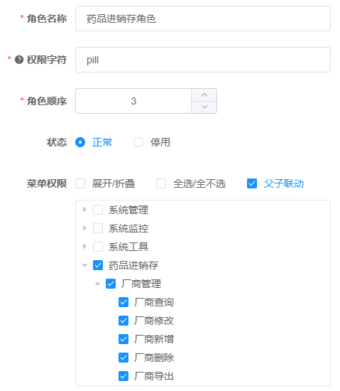

### 1. 设计表结构

- 若依框架数据库表设计结构中都存在以下的5个字段，在设计表时应该遵循这个规范：


### 2. 创建子模块以及各层

- 创建子模块时，注意在根目录和admin目录中的pom.xml文件中添加子模块依赖，不然可能会出现**controller层的接口识别不到**或者其他问题，具体参考官方文档的后台手册目录下的新建子模块：


- 注意各层的文件目录位置


### 3. 常规手写开发

**常规开发完成一个厂商列表查询接口**

1. 完成实体类

- 注意在pom文件中导入common通用模块，才能使用里面的类和三方包

```xml
    <dependencies>

        <!-- 通用工具-->
        <dependency>
            <groupId>com.ruoyi</groupId>
            <artifactId>ruoyi-common</artifactId>
        </dependency>

    </dependencies>
```

- 实体类

```java
@EqualsAndHashCode(callSuper = true)
@Data
public class PillFactory extends BaseEntity {
    private static final long serialVersionUID = 1L;

    /** 厂商Id */
    private Long FactoryId;

    /** 厂商名称 */
    private String FactoryName;

    /** 厂商编号 */
    private String FactoryCode;

    /** 联系人 */
    private String contact;

    /** 电话 */
    private String phone;

    /** 关键字 */
    private String keyword;

    /** 状态 */
    private String status;
}
```

2. 编写mapper层和xml文件

```xml
    <resultMap type="PillFactory" id="PillFactoryResult">
        <id     property="factoryId"        column="factory_id"       />
        <result property="factoryCode"      column="factory_code"     />
        <result property="factoryName"      column="factory_name"     />
        <result property="contact"      column="contact"     />
        <result property="phone"      column="phone"     />
        <result property="keyword"      column="keyword"     />
        <result property="status"        column="status"        />
        <result property="createBy"      column="create_by"     />
        <result property="createTime"    column="create_time"   />
        <result property="updateBy"      column="update_by"     />
        <result property="updateTime"    column="update_time"   />
        <result property="remark"        column="remark"        />
    </resultMap>

    <sql id="selectPillFactoryVo">
        select factory_id, factory_name, factory_code, contact, phone, keyword, status, create_by, create_time,
               update_by, update_time, remark
        from pill_factory
    </sql>

    <select id="selectPillFactoryList" parameterType="PillFactory" resultMap="PillFactoryResult">
        <include refid="selectPillFactoryVo"/>
        <where>
            <if test="factoryCode != null and factoryCode != ''">
                AND factory_code like concat('%', #{factoryCode}, '%')
            </if>
            <if test="status != null and status != ''">
                AND status = #{status}
            </if>
            <if test="factoryName != null and factoryName != ''">
                AND factory_name like concat('%', #{factoryName}, '%')
            </if>
            <if test="contact != null and contact != ''">
                AND contact like concat('%', #{contact}, '%')
            </if>
            <if test="phone != null and phone != ''">
                AND phone like concat('%', #{phone}, '%')
            </if>
            <if test="keyword != null and keyword != ''">
                AND keyword like concat('%', #{keyword}, '%')
            </if>
        </where>
    </select>
```

3. 编写service层

```java
@Service
public class PillFactoryServiceImpl implements IPillFactoryService {

    @Autowired
    private PillFactoryMapper pillFactoryMapper;

    @Override
    public List<PillFactory> selectPostList(PillFactory factory) {
        return pillFactoryMapper.selectPillFactoryList(factory);
    }
}
```

4. 编写controller层

```java
@RestController
@RequestMapping("/pill/factory")
public class PillFactoryController extends BaseController {

    @Autowired
    private IPillFactoryService factoryService;

    /**
     * 获取厂商列表
     */
//    @PreAuthorize("@ss.hasPermi('pill:factory:list')")
    @GetMapping("/list")
    public TableDataInfo list(PillFactory pillFactory)
    {
        startPage();
        List<PillFactory> list = factoryService.selectPillFactoryList(pillFactory);
        return getDataTable(list);
    }
}
```

### 4. 代码自动生成

1. 修改generator模块中的配置文件

```yml
# 代码生成
gen: 
  # 作者
  author: jiangxiong
  # 默认生成包路径 system 需改成自己的模块名称 如 system monitor tool
  packageName: com.ruoyi.pill
  # 自动去除表前缀，默认是false
  autoRemovePre: false
  # 表前缀（生成类名不会包含表前缀，多个用逗号分隔）
  tablePrefix: pill_
```

2. 在若依管理后台，使用代码生成工具


#### 4.1 代码自动生成-后端开发

- 将自动生成的src目录复制到对应子模块下面即可

#### 4.2 代码自动生成-前端开发

1. 将自动生成的代码复制到对应api和views目录中。
2. 自定义图标：将iconfont中下载的图标svg文件复制到项目的对应目录中：


3. 新增自定义的菜单：

- 添加主目录


- 添加子菜单：


- 刷新页面，即可看见新增的菜单

4. 根据需求原型，修改Index.vue组件

### 5. 功能权限分配

- 给上面添加的厂商管理菜单，新增厂商的增删改查和导出按钮菜单权限


- 新增角色和用户，赋予药品进销存菜单的所有权限。



- 使用新创建的用户登录，可以看见有该菜单的所有权限：


### 6. 脚本实现功能权限分配

- 数据库执行上述代码自动生成后产生的sql文件。
- 执行完毕后刷新页面，可以看见生成的菜单在系统工具目录下，需要更改上级菜单目录：


- 再次刷新页面，测试该菜单。

### 7. 新增字典

- 在管理后台中，新增药品类型和处方类型字典;


### 8.重点：定制化全自动代码生成

**代码自动生成只针对一张表，涉及到多张表需要做相应的修改，如下面的第9点**

- 在字段信息中定制化配置:


- 生成信息定制化配置:


- 将前后端代码复制到对应的目录下，并且在数据库执行生成的sql脚本。

- 刷新页面，即可看见生成的菜单！

### 9. 多表链接

#### 9.1 存在问题：

- 生产厂家的搜索和显示，应该是另一张表的厂家名称字段：


#### 9.2 后端修改：

1. 修改PillDurg实体类，添加PillFactory属性：

```java
    public void setPillFactory(PillFactory pillFactory) {
        this.pillFactory = pillFactory;
    }
```

2. 修改对应的mapper.xml文件：

```shell
# 1.resultMap增加下行：
<association property="pillFactory" javaType="pillFactory" resultMap="com.ruoyi.pill.mapper.PillFactoryMapper.PillFactoryResult" />

# 2.修改整体查询语句：
<sql id="selectPillDrugVo">
        select pd.*,pf.* from pill_drug pd left join pill_factory pf on pd.factory_id = pf.factory_id
</sql>
    
# 3.修改查询列表语句：
    <select id="selectPillDrugList" parameterType="PillDrug" resultMap="PillDrugResult">
        <include refid="selectPillDrugVo"/>
        <where>  
            <if test="drugName != null  and drugName != ''"> and pd.drug_name like concat('%', #{drugName}, '%')</if>
            <if test="pillFactory != null and pillFactory.factoryName != null and pillFactory.factoryName != ''"> and pf.factory_name like concat('%', #{pillFactory.factoryName}, '%')</if>
            <if test="drugType != null  and drugType != ''"> and pd.drug_type = #{drugType}</if>
            <if test="prescriptionType != null  and prescriptionType != ''"> and pd.prescription_type = #{prescriptionType}</if>
            <if test="status != null  and status != ''"> and pd.status = #{status}</if>
        </where>
    </select>
```

#### 9.3 前端修改：

1. 修改表格展示数据：

```vue
      <el-table-column label="生产厂家" align="center" prop="pillFactory.factoryName" />
      <el-table-column label="厂家编号" align="center" prop="pillFactory.factoryCode" />
```

2. 修改查询参数：

```vue
<el-form-item label="生产厂家">
        <el-input
          v-model="queryParams['pillFactory.factoryName']"
          placeholder="请输入生产厂家"
          clearable
          @keyup.enter.native="handleQuery"
        />
</el-form-item>


// 查询参数
queryParams: {
pageNum: 1,
pageSize: 10,
drugName: null,
'pillFactory.factoryName': null,
drugType: null,
prescriptionType: null,
status: null,
},
```

#### 9.4 存在问题2：

- 在新增和修改的表单中。生产厂家字段应该是一个下拉框以供选择：


#### 9.5 前端修改：

1. 新建factoryList的data列表数据，创建函数填充该列表

```vue
    /** 查询厂家信息列表 */
    getFactoryList() {
      listFactory().then(response => {
        this.factoryList = response.rows;
      });
    },
```

2. 修改表单中的生产厂家字段，改为下拉框：

```vue
<el-form-item label="生产厂家" prop="factoryId">
          <el-select v-model="form.factoryId" placeholder="请选择生产厂家">
            <el-option
              v-for="item in factoryList"
              :key="item.factoryId"
              :label="item.factoryName"
              :value="item.factoryId"
            ></el-option>
          </el-select>
</el-form-item>
```

### 10. 集成swagger ui 测试页面

1. 添加依赖：

```xml
        <!-- swagger2-->
        <dependency>
            <groupId>io.springfox</groupId>
            <artifactId>springfox-swagger2</artifactId>
            <version>2.9.2</version>
        </dependency>
        <dependency>
            <groupId>io.springfox</groupId>
            <artifactId>springfox-swagger-ui</artifactId>
            <version>2.9.2</version>
        </dependency>

        <!-- swagger ui测试页面-->
        <dependency>
            <groupId>com.github.xiaoymin</groupId>
            <artifactId>swagger-bootstrap-ui</artifactId>
            <version>1.9.6</version>
        </dependency>
```

2. 在SwaggerConfig类中添加@EnableSwagger2注解：

```java
@EnableSwagger2
public class SwaggerConfig
{
    .....
}
```

